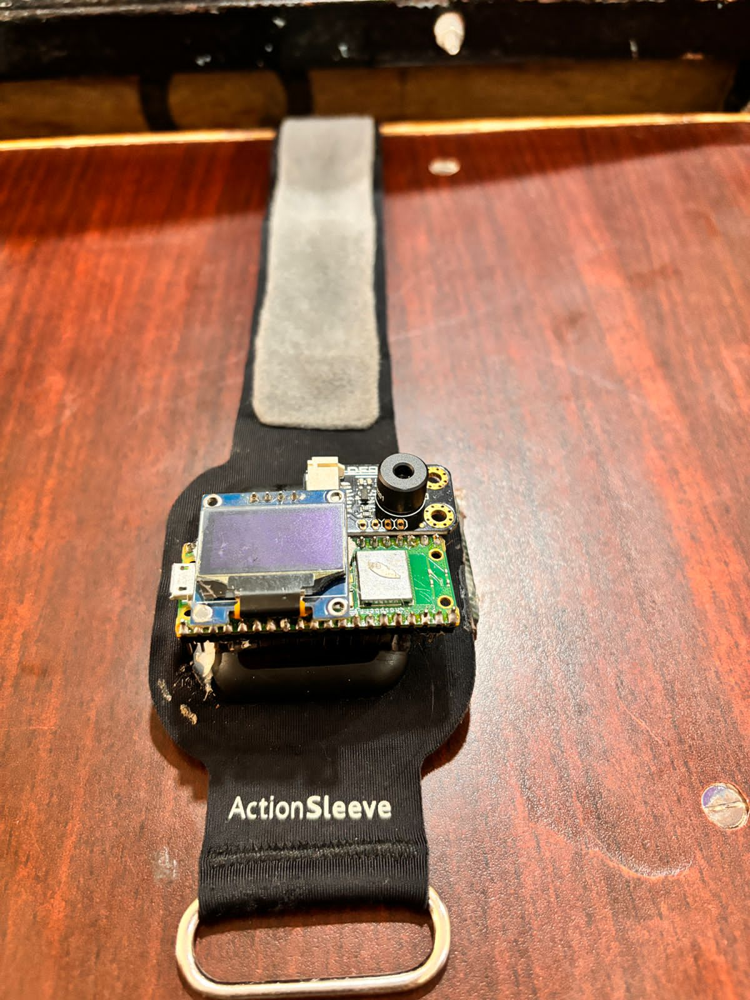
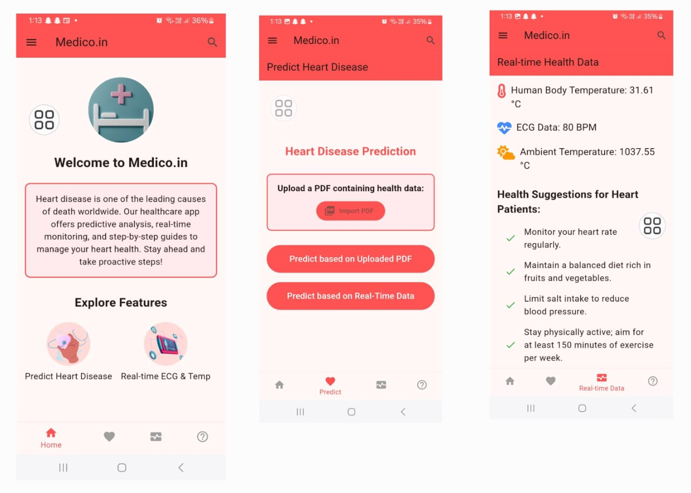

# 🏥 Medico Healthcare Device  

## 🔹 Overview  
The **Medico Healthcare Device** is an **AI-powered, IoT-integrated** system designed to **monitor and predict heart health conditions** in real-time. It leverages **wearable sensors**, **machine learning algorithms**, and **secure cloud connectivity** to provide **early warning alerts** and **actionable health insights** for patients, doctors, and caregivers.  

## 🔹 Key Features  
✅ **Real-time Health Monitoring** – Tracks **ECG, body temperature, heart rate, and SpO2**.  
✅ **AI-Based Heart Attack Prediction** – Uses **machine learning models** for **early detection** of abnormalities.  
✅ **IoT & Cloud Integration** – Data is securely stored and analyzed in the cloud for **remote access**.  
✅ **Mobile App Connectivity** – Sends **alerts** to hospitals, doctors, and family members in case of emergency.  
✅ **Low Power Consumption** – Optimized for **long battery life and efficient power usage**.  
✅ **Wearable & Portable** – **Lightweight** and **comfortable** for continuous health tracking.  
✅ **Data Security & Privacy** – Uses **encrypted transmission** to ensure patient confidentiality.  

### 📌 Medico Healthcare Device UI (Mobile App)  
| **Home Screen** | **Health Monitoring Screen** |
|---------------|------------------|
|  |  |
